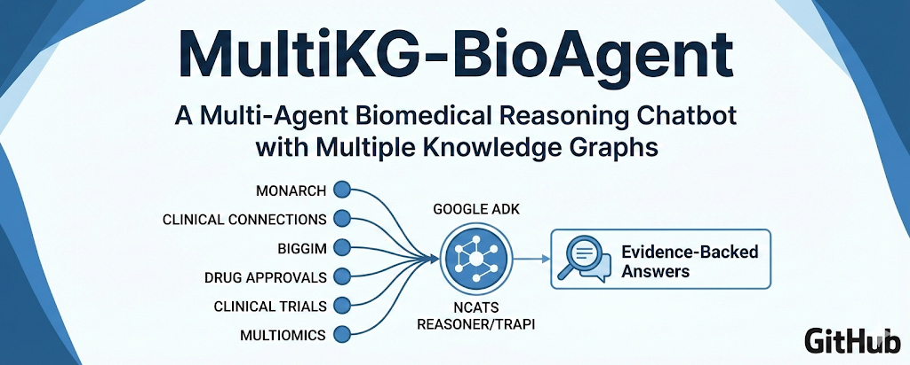
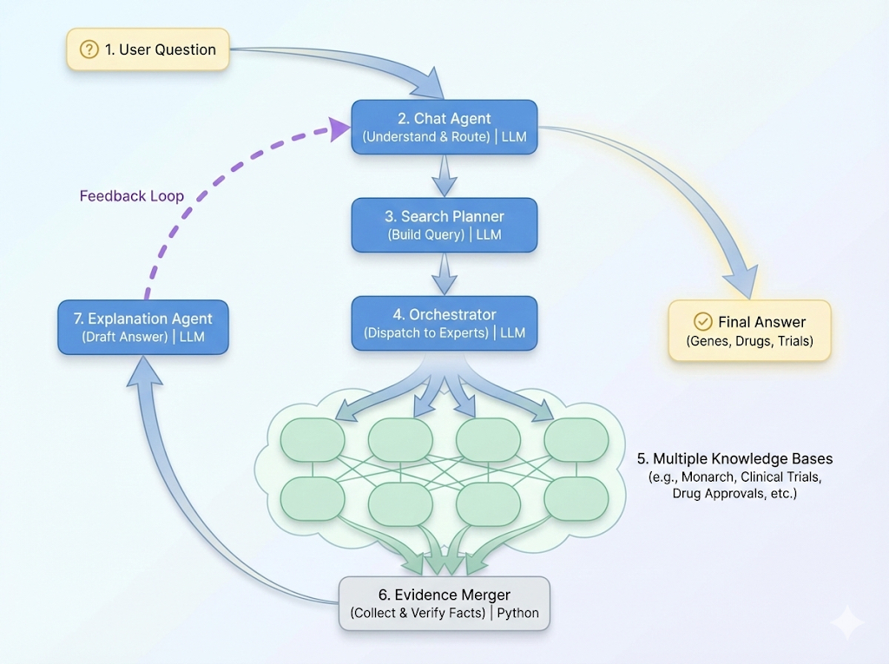
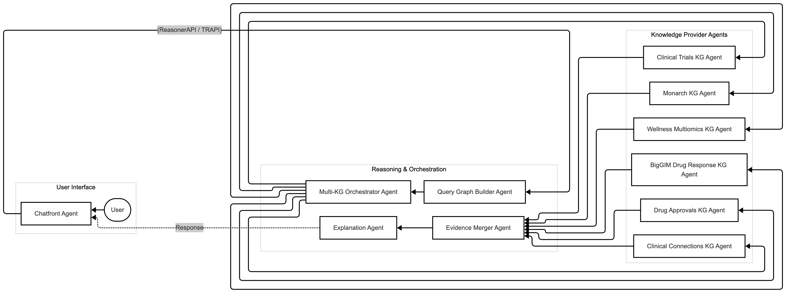

# Multi-KG BioAgent Chatbot

A **multi-agent, multi-knowledge-graph biomedical question–answering system** built with **Google ADK** and **TRAPI/ReasonerAPI**.

This project lets a user ask questions like:

> *“What causes epilepsy, which genes are involved, what drugs target those genes, and are there clinical trials?”*

The system:
1. Converts the question into a **ReasonerAPI / TRAPI query graph**.
2. Uses a **multi-agent orchestration layer** to query multiple biomedical **knowledge graphs (KGs)**:
   - Monarch Initiative KG
   - Clinical Connections KG
   - BigGIM Drug Response KG
   - Clinical Trials KG
   - Drug Approvals KG
   - Wellness Multiomics KG
3. **Merges and ranks evidence** across KGs.
4. Uses an LLM to generate a **consolidated, provenance-aware explanation**.

---



---

## Problem: Fragmented Biomedical Knowledge

Biomedical facts are scattered across many specialized KGs and APIs. No single source can fully answer multi-hop questions that span:

- Disease → Gene → Drug → Clinical Trial
- Disease → Phenotype → Gene → Pathway
- Gene → Variant → Drug Response

Clinicians and researchers must manually jump between portals and APIs, which is:

- **Time-consuming**
- **Error-prone**
- **Hard to reproduce**
- Difficult to explain or share as a single coherent answer

LLMs can explain, but **LLMs alone hallucinate** if not grounded in structured, curated knowledge.

---

##  What This Project Does

This project builds a **KG-aware chat assistant** that:

- Accepts **natural language biomedical questions**
- Generates a **TRAPI query graph** using ReasonerAPI conventions.
- Queries **multiple KGs in parallel** via agents/tools:
  - Monarch Initiative (disease–gene–phenotype)
  - Clinical Connections (causal gene–drug–disease relationships)
  - BigGIM (expression / omics / drug response)
  - Drug Approvals KG (FDA labels)
  - Clinical Trials KG (NCT trials)
  - Wellness Multiomics KG (pathways, variants, omics)
- **Merges and ranks evidence** into a canonical mini-KG slice
- Produces a **clear, explainable answer** with provenance information

---

##  High-Level Architecture




## Core Agents

-	Chatfront Agent – UI-facing conversation agent
-	Query Graph Builder Agent – converts NL question → TRAPI query graph
-	Multi-KG Orchestrator Agent – routes TRAPI queries to KPs
-	Per-KG Agents/Tools – Monarch, Clinical Connections, BigGIM, Drug Approvals, Clinical Trials, Multiomics
-	Evidence Merger Agent – canonicalises nodes/edges, aggregates scores, ranks answers
-	Explanation Agent – generates human-readable answer from merged evidence


## Information flow between agents and user interface, and external services 



## Key Technologies

- Google ADK (Agent Developer Kit) – multi-agent orchestration
- TRAPI / ReasonerAPI – standardised biomedical query/response format
- Biolink Model – semantic categories and predicates
- Python 3.10+, FastAPI – serving the chat API
- httpx – async HTTP calls to KGs
- Optional: Docker, GitHub Actions for CI

## Installation (dev)
```bash
git clone https://github.com/yogesh-parte/MultiKG-bioAgent.git
cd multikg-bioAgent

uv venv
source .venv/bin/activate   # Windows: .venv\Scripts\Activate.ps1

uv sync

```

## Documentation

See the docs/ folder for:
- PROJECT_PROPOSAL.md – problem, motivation, high-level solution
- ARCHITECTURE.md – agent design and call graph
- AGENTS.md – per-agent responsibilities and prompts
- KGS_INTEGRATION.md – how each KG is integrated
- TRAPI_EXAMPLES.md – example TRAPI messages and responses
- ROADMAP.md – planned features.

----

## Contributing

We gladly welcome issues, ideas, and PRs.

See CONTRIBUTING.md for:
- how to set up your dev environment
- coding style
- how to add a new Knowledge Provider
- how to extend the agent workflow

⸻

## License

This project is licensed under the Apache License 2.0 – see LICENSE.

⸻
## Acknowledgements

This project builds on the work of:
- NCATS Translator and the Translator ReasonerAPI/TRAPI ecosystem
- Monarch Initiative and other biomedical knowledge graph providers
- The open-source and clinical data science communities

## Team

1. Yogesh PARTE, PhD
2. Rohan Routh, MS