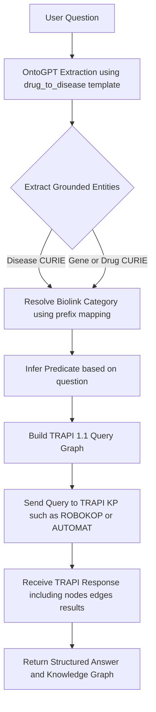

# NLP2TRAPI Agent
A lightweight Python agent that converts natural-language biomedical questions into **TRAPI-compliant query graphs**, ready to be sent to a Translator Knowledge Provider (KP) such as **ROBOKOP / AUTOMAT**.

This workflow enables questions like:

- “Which genes are associated with epilepsy?”
- “What drugs treat type 2 diabetes?”
- “Which chemicals are linked to Alzheimer’s disease?”

The agent uses **OntoGPT** to extract and ground biomedical entities (genes, diseases, drugs) and constructs a clean **TRAPI 1.1 query graph**.

---

1. Installation Requirements

    Install the dependencies:

    ```bash
    pip install ontogpt biolink-model-toolkit httpx
    ```

   install OntoGPT CLI:
    ```bash
    pip install ontogpt
    ```
1. Configure OAK / OntoGPT API Key

    OntoGPT does not take a model name or API key directly in your Python code.
    Instead, it reads credentials from the OAK configuration system.

    Set your API key once on the machine running the agent:

    For OpenAI (gpt-4o):
    ```bash
    runoak set-apikey -e openai YOUR_OPENAI_KEY
    ```
    This will create/update:

    ```bash
    ~/.config/oak/apikeys.yml
    ```

    For Google Gemini: Not implemented Yet. You will need an OPENAI compatible API key that has access to Gemini models. [See here for more details](https://ai.google.dev/gemini-api/docs/openaihttps://cloud.google.com/generative-ai/docs/get-started/create-api-key).


    OntoGPT will automatically use this configuration whenever it is called.

1. Basic Usage

    Your agent is imported as:

    ```python
    from kgagent import NLP2TRAPIAgent

    agent = NLP2TRAPIAgent()

    result = agent.process_question("Which genes are associated with epilepsy?")
    print(result)
    ```

    Output structure:

    ```python
    {
    "question": "...",
    "disease_curie": "MONDO:xxxxxxx",
    "trapi_query": { ... },
    "ontogpt_output": { ... }
    }
    ```

    If the extraction succeeds, the dictionary includes:

    `disease_curie` (or another CURIE depending on question)

    `trapi_query` – ready to send to a TRAPI endpoint

    `ontogpt_output` – full grounding payload for debugging


1. Calling a TRAPI Knowledge Provider (ROBOKOP / AUTOMAT)

    Once you have:
    ```python
    trapi_query = result["trapi_query"]
    ```

    You can call a TRAPI endpoint such as ROBOKOP:

    Endpoint
    ```python
    ROBOTRAPI_URL = (
        "https://robokop-automat.apps.renci.org/monarch-kg/query"
        "?profile=false&validate=true&subclass=true"
    )
    ```
    Async call using `httpx``:

    ```python
    import httpx
    import json

    trapi_query = result["trapi_query"]

    async with httpx.AsyncClient() as client:
        response = await client.post(
            ROBOTRAPI_URL,
            json=trapi_query,
            timeout=60
        )

    trapi_response = response.json()
    print(json.dumps(trapi_response, indent=2))
    ```
    This returns a TRAPI message containing:

    knowledge_graph.nodes

    knowledge_graph.edges

    results (binding solutions)

    supporting evidence, provenance, and KP metadata

1. Workflow


1. Future Work

    - Expand OntoGPT templates for more question types
    - Add support for multi-hop queries
    - Integrate with additional KPs and Translator services
    - Optimize runtime performance and error handling


