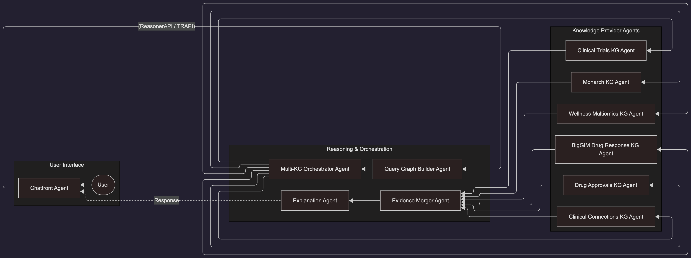
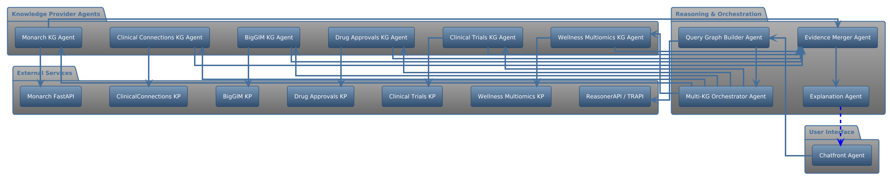

# Information flow 

** Calling Sequence 



**Mermaid: Diagram as a code**
```mermaid
---
config:
  theme: neo
  layout: elk
  look: classic
---
flowchart RL
 subgraph UI["User Interface"]
    direction TB
        CF["Chatfront Agent"]
        U(["User"])
  end
 subgraph Orchestration["Reasoning & Orchestration"]
    direction TB
        QG["Query Graph Builder Agent"]
        ORCH["Multi-KG Orchestrator Agent"]
        EV["Evidence Merger Agent"]
        EXP["Explanation Agent"]
  end
 subgraph KGAgents["Knowledge Provider Agents"]
    direction TB
        M1["Monarch KG Agent"]
        C1["Clinical Connections KG Agent"]
        B1["BigGIM Drug Response KG Agent"]
        D1["Drug Approvals KG Agent"]
        T1["Clinical Trials KG Agent"]
        W1["Wellness Multiomics KG Agent"]
  end
    U --> CF
    CF -- (ReasonerAPI / TRAPI) --> QG
    QG --> ORCH
    ORCH --> M1 & C1 & B1 & D1 & T1 & W1
    M1 --> EV
    C1 --> EV
    B1 --> EV
    D1 --> EV
    T1 --> EV
    W1 --> EV
    EV --> EXP
    EXP -. Response .-> CF

    classDef explicit fill:#f9f,stroke:#333,stroke-width:2px

  ```

# Calling sequence 


```plantuml
  @startuml
!theme spacelab
skinparam componentStyle rectangle
skinparam linetype ortho
skinparam nodesep 60
skinparam ranksep 80
skinparam rankdir LR

' --- User Interface ---
package "User Interface" {
  [Chatfront Agent] as ChatUI
}

' --- Reasoning & Orchestration ---
package "Reasoning & Orchestration" {
  [Query Graph Builder Agent] as QueryAgent
  [Multi-KG Orchestrator Agent] as Orchestrator
  [Evidence Merger Agent] as Merger
  [Explanation Agent] as Explainer
}

' --- Knowledge Provider Agents ---
package "Knowledge Provider Agents" {
  [Monarch KG Agent] as Mon_Ag
  [Clinical Connections KG Agent] as ClinConn_Ag
  [BigGIM KG Agent] as BigGIM_Ag
  [Drug Approvals KG Agent] as Drug_Ag
  [Clinical Trials KG Agent] as Trials_Ag
  [Wellness Multiomics KG Agent] as Well_Ag
}

' --- External Services ---
package "External Services" {
  [ReasonerAPI / TRAPI] as TRAPI
  [Monarch FastAPI] as Mon_KP
  [ClinicalConnections KP] as ClinConn_KP
  [BigGIM KP] as BigGIM_KP
  [Drug Approvals KP] as Drug_KP
  [Clinical Trials KP] as Trials_KP
  [Wellness Multiomics KP] as Well_KP
}

' --- FLOW 1: Query Initiation ---
ChatUI --> QueryAgent
QueryAgent --> TRAPI
QueryAgent --> Orchestrator

' --- FLOW 2: Orchestration (Fan Out) ---
' Using a hidden line to force vertical alignment helps straight lines
Orchestrator --> Mon_Ag
Orchestrator --> ClinConn_Ag
Orchestrator --> BigGIM_Ag
Orchestrator --> Drug_Ag
Orchestrator --> Trials_Ag
Orchestrator --> Well_Ag

' --- FLOW 3: External Data Fetching (1:1 Mapping) ---
' These are direct dependencies
Mon_Ag --> Mon_KP
ClinConn_Ag --> ClinConn_KP
BigGIM_Ag --> BigGIM_KP
Drug_Ag --> Drug_KP
Trials_Ag --> Trials_KP
Well_Ag --> Well_KP

' --- FLOW 4: Merging Evidence (Fan In) ---
Mon_Ag --> Merger
ClinConn_Ag --> Merger
BigGIM_Ag --> Merger
Drug_Ag --> Merger
Trials_Ag --> Merger
Well_Ag --> Merger

' --- FLOW 5: Explanation & Return ---
Merger --> Explainer
' Styling the return path to be distinct and clean
Explainer -[#blue,dashed]-> ChatUI : Final Response

@enduml

```