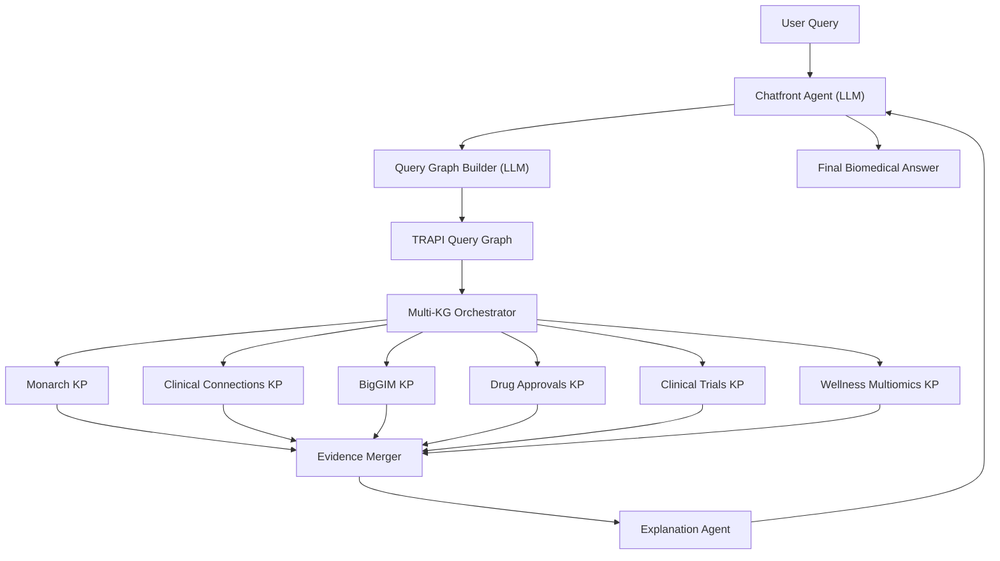

# Project Proposal 

Title: **MultiKG-BioAgent: Multi-Agent Biomedical Reasoning Assistant**

Duration: 7 workdays  

Prepared For: Kaggle Capstone Challenge 2025

Prepared By: Yogesh Parte  

Date: Nov 21, 2024

---

1. Executive Summary

Biomedical knowledge is fragmented across dozens of public Knowledge Graphs (KGs). Researchers and clinicians must manually navigate multiple APIs and portals to answer even basic questions like:

“What genes cause epilepsy and what drugs target those genes?”

This project proposes a Google ADK multi-agent system that:
- Converts natural language questions into TRAPI/ReasonerAPI query graphs
- Queries multiple biomedical KGs in parallel (Monarch, Clinical Connections, BigGIM, Clinical Trials, Drug Approvals, Multiomics)
- Merges and ranks evidence
- Generates a clear, explainable, citation-driven answer

This delivers a high-value assistant for clinicians, researchers, and data science teams — all in 5 workdays.

---

2. Problem Statement

Biomedical knowledge is:
- Distributed across many systems
- Heterogeneous in schema and formats
- Difficult to query without bioinformatics expertise
- Not integrated into a single reasoning pipeline
- Unusable by LLMs without grounding
- Time-consuming to trace provenance across KGs

Hospitals, research groups, and pharma need a single AI-assisted interface that:
- Reduces cognitive load
- Grounds answers in real knowledge
- Ensures correctness via structured data
- Eliminates hallucinations
- Supports rapid hypothesis generation

---

3. Why This Matters (Industry Rationale)

Clinician Support
- Quickly surface disease-gene-drug-trial connections.

Precision Medicine
- Assist molecular tumor boards, rare-disease teams, pharma researchers.

Data Governance
- Structured, explainable, provenance-backed outputs.

AI Safety
- LLM answers grounded in curated biomedical KGs avoid false claims.

Enterprise Scalability
- Pluggable architecture to add new knowledge providers easily.

---

4. High-Level Solution

A multi-agent pipeline built using Google ADK:
1. Chatfront Agent (LLM) — Cleans and interprets user question.
2. Query Graph Builder Agent (LLM) — Converts question → ReasonerAPI TRAPI query graph.
3. Multi-KG Orchestrator Agent — Routes TRAPI graph to specific Knowledge Provider tools.
4. KG Tools (Monarch, CC, BigGIM, Trials, Approvals, Multiomics) — Fetch structured response edges.
5. Evidence Merger Agent — Canonicalizes CURIEs, merges overlapping edges, ranks results.
6. Explanation Agent (LLM) — Produces final narrative answer with citations.

---

5. Technical Architecture

Core Technologies
- Google ADK (Agents, Tools, Workflows)
- TRAPI 1.4 / ReasonerAPI
- Biolink Model 4.1
- Python + FastAPI
- uv package manager
- httpx for async KG calls

Architecture Diagram

---

6. Scope & Deliverables (Industry Style)

D1. Multi-Agent System Implementation
- All agents implemented per folder structure
- Chatfront, Query Graph Builder, Orchestrator, Per-KG Agents
- Evidence Merger + Explanation Agent

D2. TRAPI Query Graph Generator
- Supports disease → gene
- disease → gene → drug
- disease → drug → trial
- phenotype-supported queries
- free-text mapping to MONDO, HGNC, CHEBI

D3. Per-KG Tool Integration
- Monarch API
- Clinical Connections TRAPI
- BigGIM TRAPI
- Clinical Trials KP
- Drug Approvals KP
- Wellness Multiomics KP

D4. Evidence Fusion Module
- Node canonicalization (CURIE-based)
- Edge merging and scoring
- JSON-view of consolidated mini-graph

D5. LLM Summarizer
- Biomedical-grade narration with citations
- Graph explanation

D6. Documentation
- README.md
- Architecture.md
- Project Proposal.md
- TRAPI Examples
- Agents.md
- Roadmap.md

D7. DevOps
- uv-based Makefile
- GitHub Actions pipeline
- Project banner
- Repo scaffold

---

7. Five-Day Work Plan (Aggressive, Industry-Ready)

Day 1 — Project Setup & Foundation
Deliverables:
- Repo structure
- uv environment + Makefile
- FastAPI scaffold
- Base ADK agents: Chatfront, Query Graph Builder
- GitHub Actions pipeline

Day 2 — TRAPI Query Graph + Orchestrator
Deliverables:
- Natural-language → Biolink → TRAPI graph builder
- Support for disease-gene-drug queries
- Orchestrator agent logic for routing
- Initial test cases

Day 3 — KG Tool Integration
Deliverables:
- Tool wrappers for all 6 knowledge providers
- Async HTTP clients
- Error-handling and retries
- Tests for each KP tool
- Mock responses for local-only testing

Day 4 — Evidence Merger + Explanation Layer
Deliverables:
- Node canonicalizer (HGNC/MONDO/CHEBI)
- Edge merger (score-based ranking)
- Provenance aggregator
- Explanation Agent prompt engineering
- Output JSON schema (biomedical answer object)

Day 5 — End-to-End Integration + Docs
Deliverables:
- Complete pipeline
- End-to-end demo: epilepsy example
- Final documentation and repo polishing

---

8. Risks & Mitigations

| Risk                 | Impact  | Mitigation                            |
|----------------------|---------|---------------------------------------|
| TRAPI KP downtime    | High    | Retry logic + fallback KPs            |
| Response mismatches  | Medium  | Strict CURIE canonicalization         |
| LLM hallucination    | Medium  | KG-first evidence + constraints       |
| Rate limits          | Low     | Caching and batching                  |
| Agent complexity     | Low     | Isolate responsibilities per file     |

---

9. Success Criteria

This project is successful when:
- User can ask any disease/gene/drug/trial question
- System returns KG-backed, citation-supported answers
- TRAPI graphs validate against ReasonerAPI schema
- All 6 KGs respond via orchestrator
- Merged evidence is clean and interpretable
- Docs are production quality
- Demo runs end-to-end

---

10. Team & Roles

| Role                  | Responsibility                         |
|-----------------------|----------------------------------------|
| AI Engineer           | Agents, LLM prompts                    |
| Bioinformatics Engineer| TRAPI, Biolink mapping                |
| Backend Engineer      | APIs, tools                            |
| Technical Writer      | Docs, diagrams                         |
| Domain SME            | Validate disease–gene–drug reasoning   |

This project can be executed by 1–2 engineers in 5 days if scoped tightly.

---

11. Assumptions
- Access to Google ADK
- Public KG endpoints active
- ReasonerAPI 1.4 responses accessible
- LLM available: Gemini 2.5 Flash
- Python 3.10+ environment

---

12. Final Summary

This 5-day project builds a usable, modular, multi-agent biomedical reasoning assistant that consolidates information across multiple structured KGs, minimizes hallucinations, and provides explainable, citation-backed answers.

Intended audiences:
- Healthcare R&D
- Bioinformatics teams
- Clinical researchers
- Precision medicine workflows
- Knowledge discovery and hypothesis generation

Ready for GitHub, public demos, portfolio presentations, and hospital innovation showcases.

---

